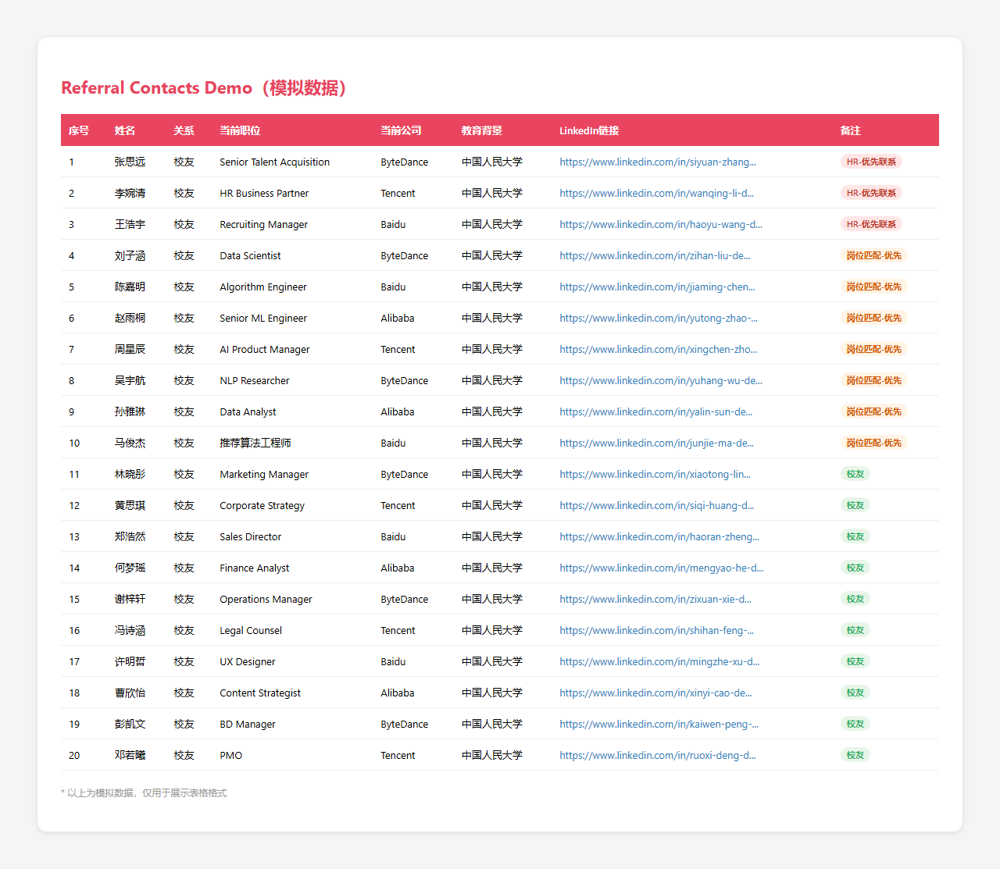

<div align="center">


# LinkedIn 内推专家

### 不靠自己投，让对的人帮你递简历

> 输入学校 + 目标公司，自动挖出可内推的人，附带可直接复制的话术模板

</div>

---

## 为什么做这个项目

找工作最难的不是投简历，而是**找到对的人帮你递简历**。

这个 Skill 帮你解决两件事：
1. **找谁内推** — 自动在 LinkedIn 上搜索目标公司的校友/前同事，按优先级排序输出 Excel
2. **怎么开口** — 根据关系远近，给你 4 套可直接复制的话术

不需要你有人脉基础，不需要手动翻 LinkedIn 翻到手酸。

---

## 核心亮点

| 功能 | 说明 |
|------|------|
| **三级优先级搜索** | 先抓 HR → 再抓岗位匹配的 → 最后补普通校友，确保你先联系最有价值的人 |
| **自动去重 + 标注** | 同一人出现在多轮搜索结果中，自动保留最高优先级标注 |
| **登录态持久化** | 首次登录后自动保存 Cookie，后续运行无需重复登录 |
| **数据自动清理** | 自动过滤关系度标识、地点噪音，提取干净的姓名/职位/公司 |
| **Excel 直接输出** | 生成带颜色标记的 Excel，HR 标红、岗位匹配标橙、普通校友标灰 |
| **4 套话术模板** | 熟人直推 / 校友弱关系 / 冷接触 / HR 专用，覆盖全场景 |

---

## 效果预览

### 输出表格（按优先级排序）



> *模拟数据，仅展示格式。实际运行会抓取真实 LinkedIn 数据。*

### 搜索策略示意

```
Round 1 (HR 优先):     "ByteDance HR Renmin University of China"
Round 2 (岗位匹配):    "ByteDance 算法工程师 Renmin University of China"
Round 3 (普通校友):    "ByteDance Renmin University of China"
```

---

## 快速开始

### 作为 Claude Code Skill 使用

```bash
# 克隆到个人 skills 目录
mkdir -p ~/.claude/skills
git clone https://github.com/Yukilin-coder/career-referral.git ~/.claude/skills/career-referral
```

然后在 Claude Code 对话中说：
> "帮我找内推，学校是中国人民大学，目标公司是字节跳动和百度，岗位是算法工程师"

### 作为独立 Python 脚本使用

```bash
# 安装依赖
pip install playwright openpyxl
playwright install chromium

# 运行示例
python scripts/linkedin_referral_scraper.py
```

### 代码调用

```python
from scripts.linkedin_referral_scraper import scrape_linkedin_referrals

results = scrape_linkedin_referrals(
    school_name="Renmin University of China",
    company_list=["ByteDance", "Baidu", "Tencent", "Alibaba"],
    target_role="算法工程师",
    max_results=30
)
```

---

## 输出字段说明

| 字段 | 说明 |
|------|------|
| **姓名** | LinkedIn 显示姓名 |
| **关系** | 校友 / 前同事 |
| **当前职位** | 职位名称（已清理噪音） |
| **当前公司** | 公司名称 |
| **教育背景** | 学校名 |
| **LinkedIn 链接** | 个人主页直达链接 |
| **备注** | `HR-优先联系` / `岗位匹配-优先` / `校友` |

---

## 内推话术模板

### 版本 A：熟人直推

> 哈喽 XX，最近怎么样？
> 看到你们公司在招 [目标岗位]，我跟这个岗位匹配度挺高的，想问问你能不能帮忙内推一下？
> 我简历和 JD 分析都准备好了，你只需要走个内推流程，不占用你什么时间。如果不方便也完全理解～

### 版本 B：校友 / 弱关系

> 哈喽 XX，我是 [学校] 的 [你的名字]，注意到你在 [公司] 做 [方向]。
> 最近看到你们公司在招 [目标岗位]，我的背景和岗位要求挺匹配的，想问问能不能麻烦你帮忙内推一下？
> 简单说下我的背景：[2-3 句话核心经历]。我已经把简历和目标岗位整理好了，你只需要转发一下。
> 如果你最近不方便也没关系，完全理解。先谢啦！

### 版本 C：冷接触

> 哈喽 XX，我是 [你的名字]，[身份标签]。关注你有一段时间了，[具体指出对方哪条内容对你有启发]，很受用。
> 最近看到你们公司在招 [目标岗位]，我的背景和岗位要求匹配度挺高的，想冒昧问一下，能不能请你帮忙内推？
> 我的核心背景是：[2-3 句话亮点]。我已经准备好了简历和岗位分析，如果你觉得合适，内推流程我来配合。
> 如果不方便也完全理解，打扰了。

### 版本 D：HR 专用（更直接）

> 哈喽 XX，我是 [你的名字]，[学校/前公司] 背景，目前在看 [目标岗位] 的机会。
> 看到贵司在招这个岗位，我的背景和 JD 要求匹配度挺高的。想冒昧问一下，能否帮我推荐到合适的团队？
> 简历和 JD 分析已准备好，如果方便的话我可以发你详细材料。打扰了，期待你的回复！

---

## 技术栈

- **Playwright** — LinkedIn 页面自动化
- **openpyxl** — Excel 生成与样式
- **Python 正则** — 数据清洗（关系度过滤、地点过滤）
- **三级搜索策略** — HR → 岗位 → 校友的优先级队列

---

## 风险提示

LinkedIn 对异常流量有风控机制，建议：

- 单次爬取不超过 **40 人**
- 每次搜索间隔 **2-3 秒**
- 遇到验证码或限制立即停止，切换手动搜索
- 首次使用需要手动登录 LinkedIn，后续自动复用登录态

---

## 项目结构

```
career-referral/
├── README.md                          # 本文件
├── SKILL.md                           # Claude Code Skill 定义
├── scripts/
│   └── linkedin_referral_scraper.py   # 核心爬取脚本
└── reference/
    ├── demo-screenshot.png            # 输出表格截图
    ├── referral-contacts-demo.xlsx    # 模拟数据 Excel
    └── generate_demo.py               # 模拟数据生成脚本
```

---

## License

MIT © Yukilin-coder
